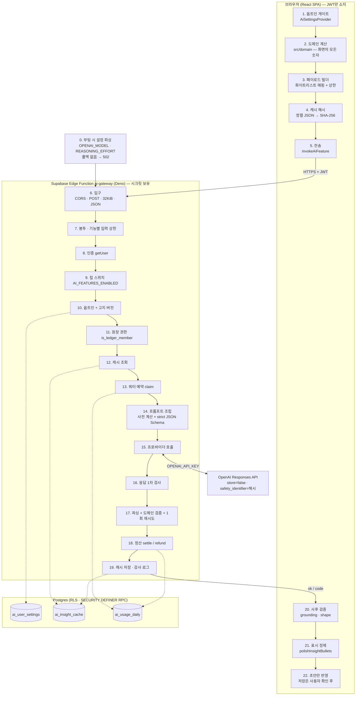
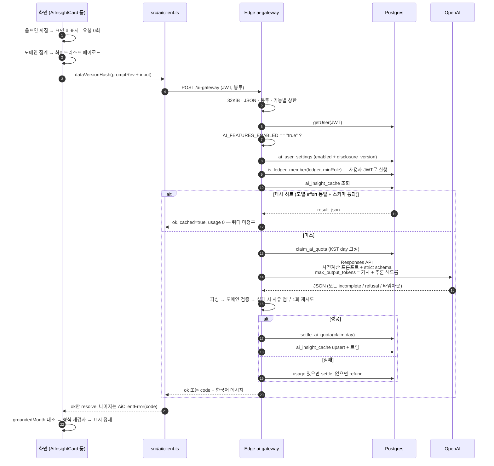
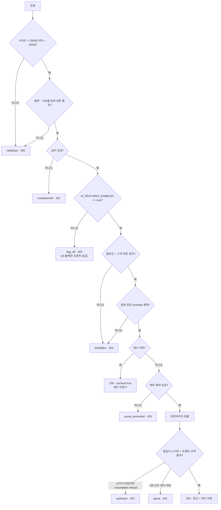
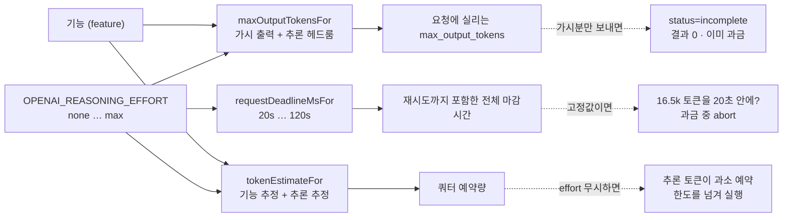
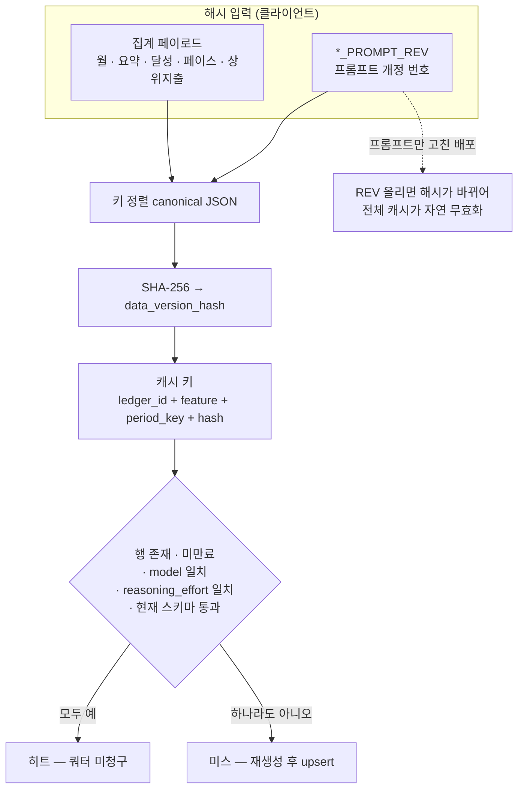
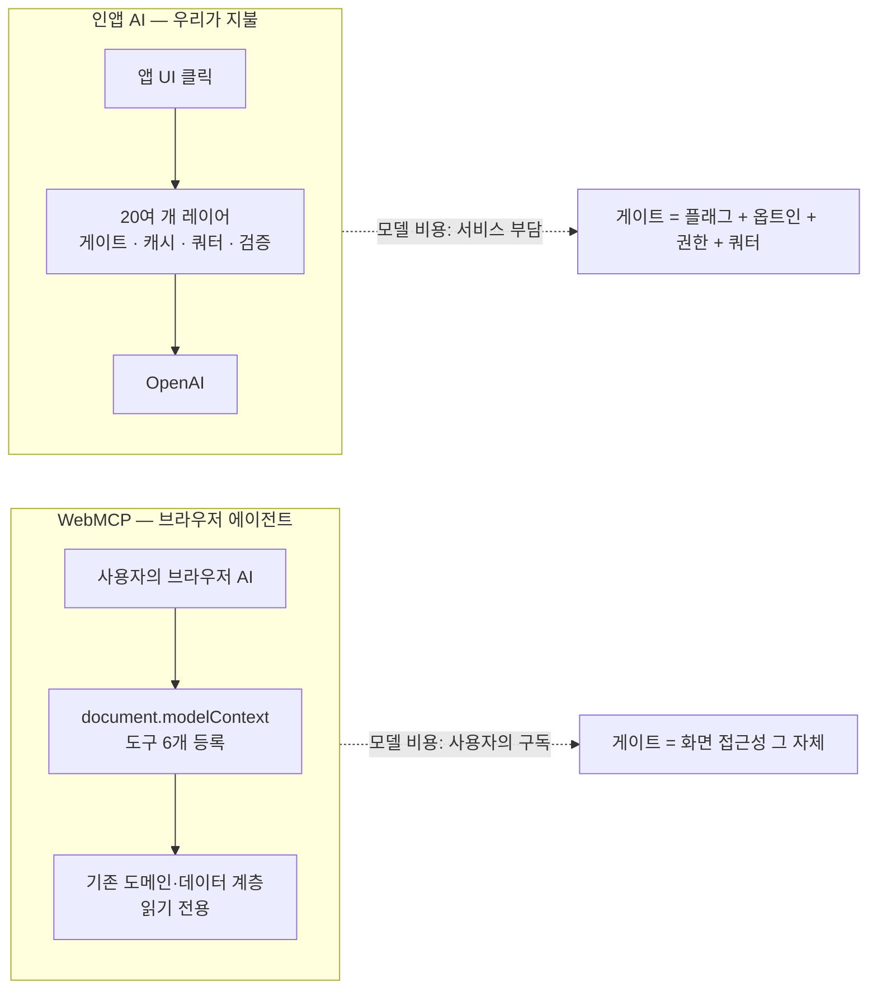

# 가계부 (Household Account Book)

개인·가정의 수입과 지출을 한곳에서 기록하고, 월별로 얼마나 썼는지·남는 돈이 얼마인지 확인하는 가계부 웹앱입니다.  
엑셀 가계부처럼 **설정 → 거래 입력 → 월 요약** 흐름을 따르며, 모바일에서도 편하게 쓸 수 있도록 화면을 구성했습니다.

## 이 앱으로 할 수 있는 것

- **매달 돈의 흐름 파악** — 수입, 지출, 저축, 투자를 나눠 기록하고, 이번 달 남는 돈(수지)을 바로 확인합니다.
- **거래 내역 관리** — 월·구분·카테고리·메모로 내역을 찾고, 추가·수정·삭제할 수 있습니다.
- **예산·목표 추적** — 지출 카테고리에는 예산, 저축 카테고리에는 목표 금액을 두고 달성 현황을 봅니다. 지출 예산에는 **예산 페이스**(남은 일수·하루 허용액)를 켜 두면 이번 달 소비 속도를 확인할 수 있습니다.
- **고정 항목** — 월급, 월세, 구독료처럼 매달 반복되는 항목을 등록해 두면 해당 월을 열 때 거래로 반영됩니다.
- **엑셀보내기** — 거래 내역 화면에서 현재 필터(월·구분·카테고리·메모)에 맞는 내역을 `.xlsx` 파일로 받을 수 있습니다.
- **통계 보기** — 최근 3·6·12개월 추이와 카테고리별 지출을 차트로 비교합니다.
- **인앱 AI (옵트인)** — 설정에서 고지를 확인하고 켠 뒤에만 동작합니다. API 키는 브라우저에 두지 않고 Supabase Edge Function이 OpenAI를 호출합니다.
  - **자연어 거래 초안** — 거래 추가 시트에 문장으로 입력하면 금액·구분·카테고리·메모를 폼에 채웁니다. **적용은 초안만**이며, 원장 저장은 사용자가 확인한 뒤 기존 저장 버튼으로만 이뤄집니다.
  - **월 인사이트·절약 팁** — 원시 거래가 아닌 월 합계·예산/목표 달성률·계획 대비 실제 지출 비중·상위 지출 같은 집계만 전송해 짧은 인사이트를 만듭니다. 절약 팁은 앱의 규칙 기반 계산으로 만들며, 진행 중인 달에는 남은 기간의 추가 지출을, 마감된 달에는 다음 달 예산 조정을 안내합니다.
  - **월 마감 점검 내러티브** — 과거 월 요약에서 빠진 고정 항목·중복 의심·메모 없는 큰 지출·예산 초과·목표 미달 등 점검을 펼쳐 볼 수 있고, 그 결과를 짧은 글로 요약합니다.
- **AI 브라우저 에이전트 연동 (WebMCP)** — WebMCP 지원 브라우저의 AI 에이전트가 앱에 등록된 6개 도구를 호출합니다. 요약 화면에서는 전체·카테고리별 예산 페이스, 통계 화면에서는 월별 추이·카테고리 상세·최근 두 달 비교, 로그인 후에는 지정한 달의 마감 점검을 물을 수 있습니다. 인앱 AI와 별개이며, **앱 안 챗봇 UI는 없습니다.**

## 자금 구분

모든 거래는 아래 네 가지 중 하나로 분류됩니다.

| 구분 | 의미                             | 예산·목표                |
| ---- | -------------------------------- | ------------------------ |
| 수입 | 들어오는 돈 (월급, 부수입 등)    | 없음                     |
| 지출 | 소비되는 돈 (식비, 생활비 등)    | 카테고리별 **예산** 설정 |
| 저축 | 모으는 돈 (비상금, 여행 적금 등) | 카테고리별 **목표** 설정 |
| 투자 | 투자로 배정하는 돈               | 없음                     |

**수지**는 `수입 − 지출 − 저축 − 투자`로 계산됩니다.  
수입과 투자는 목표 개념이 없고, 지출만 예산·저축만 목표를 관리합니다.

## 화면 구성

하단 탭 라벨은 **요약 · 내역 · 통계 · 설정**입니다.

| 화면       | 하는 일                                                                                                                                                                                        |
| ---------- | ---------------------------------------------------------------------------------------------------------------------------------------------------------------------------------------------- |
| **로그인** | 이메일로 가입·로그인. 가입 시 기본 가계부와 초기 카테고리가 만들어집니다.                                                                                                                      |
| **요약**   | 연·월을 선택해 총수입·총지출·총저축·총투자·수지, 예산/목표 달성 현황(예산 페이스 포함), 차트를 봅니다. 인앱 AI가 켜져 있으면 월 인사이트·절약 팁, 과거 월에는 마감 점검도 표시됩니다.          |
| **내역**   | 월·구분·카테고리·메모로 필터링한 거래 목록. 하단 **+** 또는 화면에서 추가·수정하고, **보내기**로 필터된 내역을 엑셀 파일로 보냅니다. 인앱 AI를 켜면 거래 추가 시 자연어 초안을 쓸 수 있습니다. |
| **통계**   | 기간(3·6·12개월)을 정해 월별 수입·지출·저축·투자·수지 추이와 지출 카테고리 비교를 봅니다.                                                                                                      |
| **설정**   | 카테고리(아이콘·예산·목표·예산 페이스)와 고정 항목을 관리하고, 가계부 이름·통화 기준을 확인합니다. **인앱 AI 고지·사용 토글**과 로그아웃도 이 화면에 있습니다.                                 |

요약 화면은 거래 CRUD 기준 **확인 전용**입니다. 거래를 넣거나 고치려면 내역 화면이나 하단 **+**, 설정(고정 항목·카테고리)을 사용합니다.

## 사용 흐름 예시

1. 가입 후 **설정**에서 카테고리 아이콘·예산·저축 목표·예산 페이스와 고정 항목(월급, 월세 등)을 정합니다. 인앱 AI를 쓰려면 고지를 확인한 뒤 **인앱 AI 사용**을 켭니다.
2. 평소에는 하단 **+** 버튼이나 **내역**에서 지출·수입을 기록합니다. AI가 켜져 있으면 자연어 한 줄로 초안을 채운 뒤 확인하고 저장합니다.
3. **요약**에서 이번 달 수지와 예산 초과 여부, 남은 일수 기준 하루 허용액을 확인합니다. AI가 켜져 있으면 인사이트와 기간에 맞는 절약 팁을 보고, 후보가 여러 개일 때 **다시 생성**으로 다른 규칙 기반 팁을 확인할 수 있습니다. 과거 월에서는 마감 점검도 봅니다.
4. **통계**에서 몇 달간의 패턴을 보며 다음 달 계획에 참고합니다.
5. 필요하면 **내역**의 **보내기**로 해당 월 내역을 엑셀로 받아 백업하거나 다른 도구에서 활용합니다.

## 기술 구성

- **Frontend**: React 19, TypeScript, Vite, React Router, Tailwind CSS, Recharts
- **Backend/Data**: Supabase Auth, Postgres, Row Level Security, RPC
- **인앱 AI**: Supabase Edge Function `ai-gateway` → OpenAI Responses API (키는 서버 시크릿만; 클라이언트 `VITE_*` 금지)
- **브라우저 AI 연동**: WebMCP (`@mcp-b/global`, `@mcp-b/react-webmcp`) — 읽기 위주 도구를 브라우저 에이전트에 노출
- **Tooling**: pnpm, Vite+ (Vitest, Oxlint, Oxfmt), Testing Library

## 코드 구조

| 경로                    | 역할                                                                                     |
| ----------------------- | ---------------------------------------------------------------------------------------- |
| `src/features/`         | 로그인·요약·내역·통계·설정 화면과 화면 단위 컴포넌트                                     |
| `src/auth/`, `src/app/` | 인증·가계부 컨텍스트, 공통 레이아웃, 비동기 조회·새로고침·페이지네이션 훅                |
| `src/data/`             | Supabase 조회·변경과 DB의 `snake_case` 행을 도메인 모델로 변환하는 계층                  |
| `src/domain/`           | 월 요약, 예산 페이스, 통계, 마감 점검, 입력 검증처럼 I/O 없는 순수 계산                  |
| `src/webmcp/`           | 화면 문맥에 맞춘 WebMCP 도구 등록과 구조화된 입출력                                      |
| `supabase/migrations/`  | Postgres 스키마, RLS, 가입 초기화, 고정 항목 반영·동기화 RPC                             |
| `supabase/functions/`   | 인증·옵트인·권한·쿼터·캐시·응답 검증을 거쳐 OpenAI를 호출하는 `ai-gateway` Edge Function |

Supabase 클라이언트는 `src/lib/supabase.ts`의 싱글턴만 사용합니다. 고정 항목은 월을 열 때 실제 거래로 멱등 반영되므로 요약·내역·통계·내보내기가 같은 거래 데이터를 읽습니다. 변경 후에는 공통 새로고침 버전을 올려 각 화면이 최신 데이터를 다시 조회합니다.

## 인앱 AI 파이프라인

인앱 AI는 "사용자 입력을 모델에 보내고 답을 받아 그린다"가 아닙니다. 버튼 한 번에서 화면에 문장이 뜨기까지 **20여 개의 레이어**를 지나며, 각 레이어는 아래 세 가지 중 하나를 지키기 위해 존재합니다.

| 지켜야 하는 것         | 왜                                                                                                                     |
| ---------------------- | ---------------------------------------------------------------------------------------------------------------------- |
| **키 경계**            | `OPENAI_API_KEY`가 브라우저에 있으면 모든 방문자에게 배포됩니다. 브라우저는 Supabase JWT만 들고, 호출은 Edge가 합니다. |
| **숫자 경계**          | 화면의 모든 금액은 `src/domain/`의 순수 계산이 소유합니다. 모델은 **문장만** 씁니다.                                   |
| **유료 호출이라는 점** | 실패·중복·악성 페이로드가 곧 비용입니다. 그래서 게이트 → 캐시 → 예약 → 정산 순서가 강제됩니다.                         |

### 전체 지도



### 요청 한 번의 순서



### 관문 순서와 실패 코드

쿼터 예약이 **모든 권한 게이트와 캐시 조회 뒤**에 오는 것이 핵심입니다. 거부될 요청이 한도를 소모하지 않고, 캐시로 답할 수 있는 요청은 예약 자체를 건너뜁니다.



클라이언트는 이 7개 코드를 `AiClientError`로 받아 각각 한국어 메시지를 붙입니다. `flag_off`만 예외적으로 **오류가 아니라 숨김**으로 처리되어, 킬 스위치를 내려도 같은 화면의 도메인 산출물(마감 점검 항목, 규칙 기반 팁)은 그대로 남습니다.

### 각 단계가 존재하는 이유

앞 다이어그램의 번호를 묶은 것입니다. "무엇을 하는가"보다 **이 관문이 없으면 무엇이 깨지는가**를 기준으로 읽는 편이 빠릅니다.

| 단계                      | 하는 일                                                                                                                          | 빼면 생기는 일                                                            |
| ------------------------- | -------------------------------------------------------------------------------------------------------------------------------- | ------------------------------------------------------------------------- |
| **0. 배포 설정**          | 모델과 추론 강도를 부팅 때 한 번 파싱합니다. 폴백이 없고, 킬 스위치보다 먼저 걸립니다                                            | 검증 안 된 모델 id가 프로바이더까지 도달하고, 킬 스위치로도 막지 못합니다 |
| **1–2. 자격과 숫자**      | 옵트인 여부를 세션당 한 번 확인하고, 화면의 모든 금액은 도메인 계층이 미리 계산해 둡니다                                         | 모델이 지어낸 금액이 장부처럼 보입니다                                    |
| **3–4. 보낼 내용 결정**   | 필요한 집계만 필드 단위로 옮겨 담고 상한을 씌운 뒤, 그 결과로 캐시 키를 만듭니다                                                 | 장부 전체가 외부로 나가고, 같은 질문에 매번 새 비용이 붙습니다            |
| **5. 단일 호출 지점**     | 게이트웨이를 부르는 곳을 하나로 묶고, 성공이 아닌 모든 결과를 7개 코드 중 하나로 정규화합니다                                    | 화면마다 오류 처리가 제각각이 됩니다                                      |
| **6–7. 형식 방어**        | 크기·JSON·봉투·기능별 상한을 확인합니다. 집계는 **자기 정합성**(수지 = 수입−지출−저축−투자)까지 봅니다                           | 거대하거나 자기모순인 페이로드가 그대로 과금 구간에 들어갑니다            |
| **8–11. 4중 권한 게이트** | 로그인 → 전역 킬 스위치 → 사용자 옵트인·고지 버전 → 원장 역할. 넷 다 **비용이 발생하기 전에** 놓입니다                           | 거부될 요청이 이미 돈을 쓴 뒤에 거부됩니다                                |
| **12. 캐시**              | 같은 집계·같은 모델·같은 추론 강도이고, 결과가 지금 스키마를 통과할 때만 히트로 인정합니다                                       | 모델을 바꿔도 옛 문장이 나오고, 깨진 캐시가 TTL 내내 카드를 망가뜨립니다  |
| **13. 쿼터 예약**         | 추론 토큰까지 포함해 미리 예약합니다. 예약·정산·환불은 서비스 롤 전용 경로입니다                                                 | 사용자 토큰으로 환불을 반복 호출해 예약을 지울 수 있습니다                |
| **14. 프롬프트 조립**     | 초과분·잔여액 같은 파생 금액을 **서버가 계산해 넣고** 인용만 하게 합니다. 데이터는 태그로 감싸 "명령이 아님"을 명시합니다        | 모델이 금액을 재계산하며 틀리고, 메모에 섞인 문장이 지시처럼 먹힙니다     |
| **15. 프로바이더 호출**   | 추론 강도에서 마감시간과 토큰 예산을 함께 유도하고, 사용자 id는 해시로 바꿔 보내며 보관은 끕니다                                 | 과금된 뒤 잘리거나 중단되고, 원 UUID가 외부에 남습니다                    |
| **16–17. 응답 검증**      | HTTP·중단·거부·빈 응답을 걸러낸 뒤, JSON 스키마가 표현하지 못하는 **문장 규칙**을 따로 봅니다. 실패하면 사유를 붙여 한 번 재시도 | 형식은 맞지만 틀린 조언이 그대로 나가고, 재시도가 비용을 배로 만듭니다    |
| **18–19. 정산·기록**      | 성공은 실제 사용량으로, 실패는 **과금 여부**로 갈라 정산합니다. 캐시를 갱신하고 감사 로그를 한 줄 남깁니다                       | 자정을 넘긴 호출이 예약을 붙잡고, 장애 원인을 추적할 수 없습니다          |
| **20–22. 받은 뒤**        | 요청한 월·기간과 일치하는지 대조하고 표현만 정리해 보여줍니다. 거래는 **초안으로만** 채워지고 저장은 기존 확인 경로를 탑니다     | 다른 달 문장이 이번 달로 표시되고, AI가 원장에 조용히 씁니다              |

### 추론 강도 · 토큰 예산 · 마감시간은 하나의 결정

Responses API는 **추론 토큰도 `max_output_tokens`에 포함**해 계산합니다. 그래서 `config.ts`는 세 숫자를 모두 `(기능, effort)`에서만 유도하며, 다른 곳에서 조립하는 것을 금지합니다.



세 갈래 모두 **프로바이더가 이미 청구한 뒤에** 실패한다는 공통점이 있습니다. `config.test.ts`는 헤드룸만 올리고 마감시간을 안 올리면 실패합니다.

### 캐시 키와 무효화

집계가 같으면 같은 문장이 나오므로, 캐시 히트는 쿼터 청구를 **완전히 건너뜁니다**. 문제는 "집계는 그대로인데 프롬프트만 개선한 배포"입니다. 해시가 입력에서만 유도되면 TTL 7일 내내 옛 문장이 나갑니다.



`*_PROMPT_REV`는 **해시 계산에만** 들어가고 게이트웨이 `input`으로는 전송되지 않습니다. Edge의 프롬프트를 고쳤다면 `src/ai/types.ts`의 해당 REV를 반드시 올려야 합니다.

### 쿼터 회계 — 현재 상태

한도 자체는 **migration 0018로 비구속**입니다. 이 배포는 사용자가 곧 OpenAI 계정 소유자이므로, 비용 상한은 앱의 토큰 회계가 아니라 프로바이더의 지출 한도에 두는 것이 맞습니다(그 상한은 우리 회계가 틀려도 유효합니다). 다만 `claim → settle/refund` 경로는 그대로 살아 있어 `ai_usage_daily`에 기능별 실사용량이 계속 쌓이고, 재활성화는 숫자 하나를 바꾸는 마이그레이션 한 번입니다.

알려진 회계 갭: 실패 처리는 *왜 실패했는지*가 아니라 *프로바이더가 사용량을 돌려줬는지*로 갈립니다. 타임아웃은 사용량 없이 끊기므로 전액 환불되지만 프로바이더는 이미 청구했으므로, 기록된 사용량은 실제보다 적습니다. 한도를 다시 켠다면 이 지점을 먼저 고쳐야 합니다.

### 왜 두 개의 AI가 서로 다른 구조인가

앱에는 **서로 코드 경로를 공유하지 않는** AI 표면이 두 개 있습니다. 위의 레이어는 전부 오른쪽(인앱 AI)에만 존재합니다.



|                | WebMCP (`src/webmcp/`)        | 인앱 AI (`src/ai/` + `ai-gateway`)    |
| -------------- | ----------------------------- | ------------------------------------- |
| 모델 실행 주체 | 사용자의 브라우저 에이전트    | 우리 Edge Function이 호출하는 OpenAI  |
| 비용 부담      | 사용자의 에이전트 구독        | 서비스 — 그래서 쿼터·캐시·킬 스위치   |
| 트리거         | 에이전트가 등록된 도구를 호출 | 사용자가 앱 UI에서 클릭               |
| 쓰기 권한      | 없음(읽기 전용 도구)          | 없음(초안만, 저장은 사용자 확인 경로) |
| 앱 내 챗봇 UI  | 없음(의도된 설계)             | 없음(의도된 설계)                     |

운영 중 `code: "upstream"`을 만났다면 감사 로그의 `upstream_reason` / `upstream_status` / `error_detail`로 원인을 좁힐 수 있습니다 — 표는 [`supabase/functions/ai-gateway/README.md`](supabase/functions/ai-gateway/README.md)에 있습니다.

## 로컬 실행

Supabase 프로젝트가 필요합니다. 루트에 `.env`를 만들고 아래 값을 넣습니다.

```
VITE_SUPABASE_URL=https://<project>.supabase.co
VITE_SUPABASE_PUBLISHABLE_KEY=<anon public key>
```

DB 스키마는 [`supabase/migrations/`](supabase/migrations/)를 Supabase CLI로 적용합니다.

```bash
supabase link --project-ref <your-project-ref>
supabase db push
```

그다음 의존성을 설치하고 개발 서버를 실행합니다.

```bash
pnpm install
pnpm dev
```

| 명령              | 설명               |
| ----------------- | ------------------ |
| `pnpm dev`        | 개발 서버          |
| `pnpm build`      | 프로덕션 빌드      |
| `pnpm preview`    | 빌드 결과 미리보기 |
| `pnpm test`       | 테스트 실행        |
| `pnpm test:watch` | 테스트 감시 모드   |
| `pnpm lint`       | 린트               |
| `pnpm format`     | 포맷 적용          |

## 프론트엔드 배포

`amplify.yml`은 AWS Amplify Hosting에서 의존성을 설치하고 `pnpm build`를 실행한 뒤 `dist/`를 배포합니다. 빌드 시 `vite/spaFallback.ts`가 알려진 클라이언트 라우트별 `index.html`을 만들지만, Amplify에서는 새로고침과 직접 접근을 위해 [`amplify-redirects.json`](amplify-redirects.json)의 규칙도 콘솔 **Rewrites and redirects**에 등록해야 합니다.

WebMCP Origin Trial 토큰은 `index.html`에 있으며 현재 배포 도메인에 묶여 있습니다. 도메인을 바꾸면 새 도메인용 토큰으로 교체해야 합니다. 프론트 배포에는 `ai-gateway`가 포함되지 않으므로 인앱 AI를 사용하려면 아래 Edge Function을 별도로 배포합니다.

## AI 게이트웨이 (Edge Function) 배포

인앱 AI는 SPA가 아니라 **Supabase Edge Function `ai-gateway`** 가 OpenAI Responses API를 호출합니다.

API 키는 클라이언트/`VITE_*`에 넣지 않습니다. Amplify(`amplify.yml`)는 프론트 `dist/`만 빌드하므로, **함수 배포는 Amplify와 분리**합니다.

### 1. 시크릿 설정

```bash
supabase secrets set OPENAI_API_KEY=...
# 필수: 모델과 reasoning effort (기본값·폴백 없음)
supabase secrets set OPENAI_MODEL=gpt-5.6-luna
supabase secrets set OPENAI_REASONING_EFFORT=<none|minimal|low|medium|high|xhigh|max>
# 글로벌 킬 스위치: dark launch 중에는 false, 실제 호출을 열 때만 true
supabase secrets set AI_FEATURES_ENABLED=false
# AI_QUOTA_TZ 기본은 Asia/Seoul — 쿼터 일/월 경계는 DB RPC가 KST 기준
```

플랫폼이 주입하는 값(`SUPABASE_URL`, `SUPABASE_ANON_KEY`, `SUPABASE_SERVICE_ROLE_KEY`)은 보통 별도 설정이 필요 없습니다. 로컬 서빙 시에는 `supabase start` 환경에 맞춰 자동 주입됩니다.

`OPENAI_MODEL`·`OPENAI_REASONING_EFFORT`는 시작 시 파싱되며 폴백이 없습니다. 값이 잘못되면 킬 스위치보다 먼저 걸려 모든 요청이 502로 떨어지므로, **첫 배포 전에 반드시 설정**합니다. effort를 올리면 요청당 생성 가능한 토큰(추론 포함)과 쿼터 예약량이 함께 올라갑니다 — 근거와 조정 지점은 `supabase/functions/ai-gateway/README.md` 참고.

### 2. 함수 배포 / 롤백

```bash
# AI 관련 DB 스키마 적용 후
supabase db push

# 함수만 배포 (SPA 배포와 독립)
supabase functions deploy ai-gateway

# 롤백: 킬 스위치 또는 함수 제거
supabase secrets set AI_FEATURES_ENABLED=false
# supabase functions delete ai-gateway   # 필요 시
```

### 3. 로컬 검증

```bash
supabase start
supabase functions serve ai-gateway --env-file supabase/.env.local
# JWT + body로 POST /functions/v1/ai-gateway
pnpm exec vp test run supabase/functions/ai-gateway/gateway.test.ts
```
